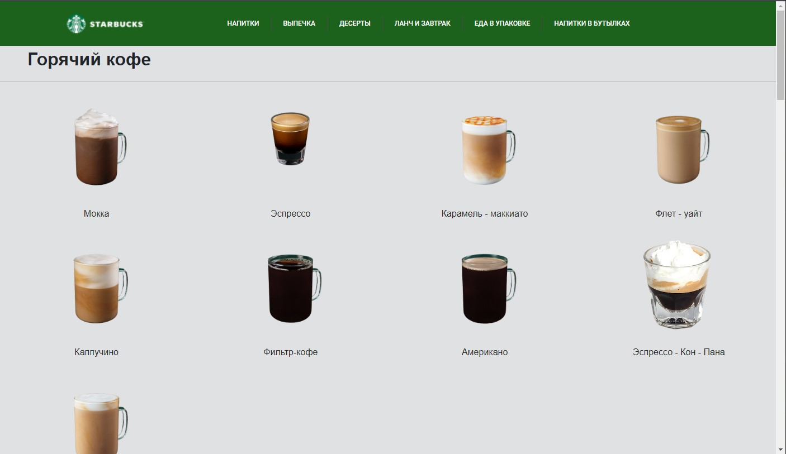
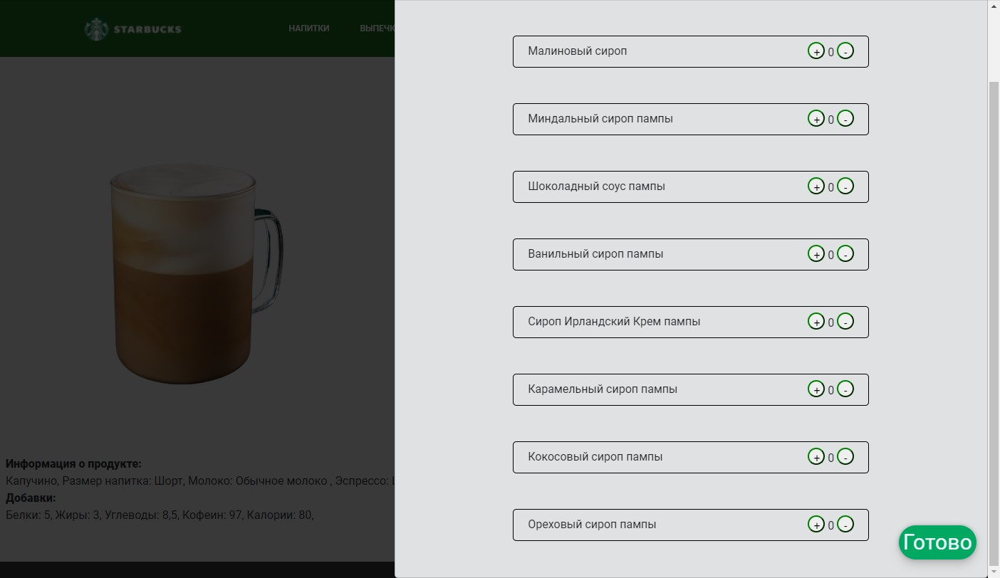

# Starbucks-Calorimeter
Hello there!  
This website allows you to configure your coffee and see the energy value, proteins, fats and carbohydrates.  
It was our university project

Actually inside the project you will find a terrible code, because the main features were done on the last night.  

Asp.net core mvc   .net 6.0   C# 10
--
Гордейчик Даниил, Половинкин Максим, Некипелов Матвей